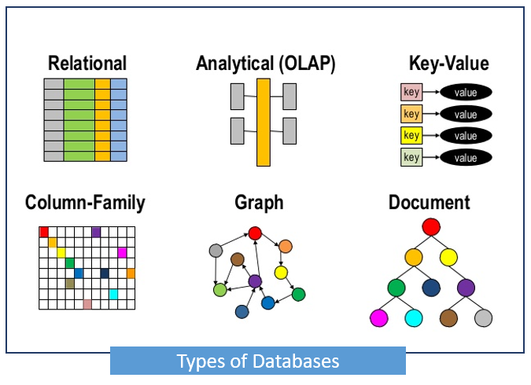
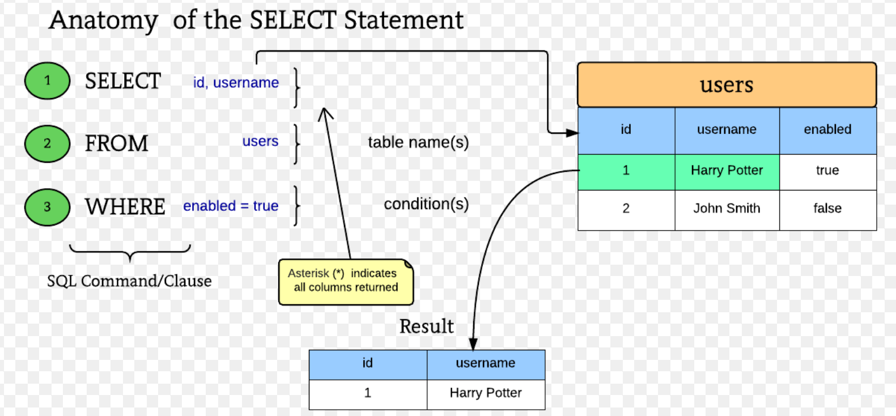
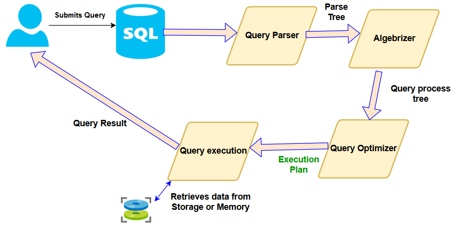
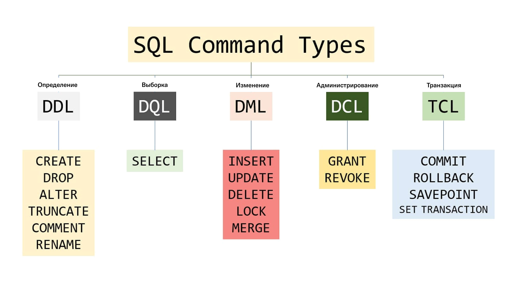

# СУБД

    СУБД - системы управления базами данных

Что же такое тогда БД?

    База данных - совокупность данных, хранимых в соответствии с определённой структурой

Отличие:

- БД это данные и их структура
- СУБД это комплекс программ, необходимых для работы с БД 

Что умеет СУБД:

- Создавать/изменять/удалять БД
- Манипулировать данными
- Обеспечивает безопасность и целостность данных
- кучу всего другого...

### Виды баз данных:

1. Древовидные
2. Объектные
3. Реляционные
4. и т.д.

Каждая СУБД строится на основе какой-то модели БД.

### Устройство БД

1. `Schema` - структура таблиц
2. `information_schema` - данные о сервере, таблицах, различная статистика и т.д.

## SQL

SQL - язык структурированных запросов. Необходим для взаимодействия с СУБД, в частности для взаимодействия с БД.

### Структура sql запроса

### Как работает sql server

### Группы команд Sql 

